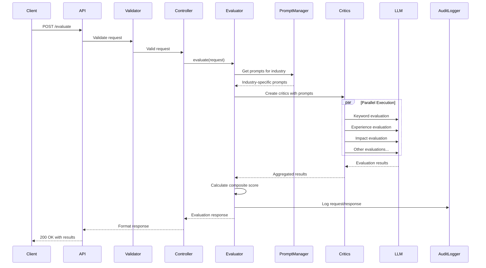

# Resume Evaluation API Architecture Design

## Executive Summary

This document outlines the architecture for a sophisticated resume evaluation API that uses an ensemble of AI critics to provide comprehensive feedback. The system is designed to be modular, scalable, and easily extensible with industry-specific evaluation criteria.

## Table of Contents

1. [System Overview](#system-overview)
2. [Core Architecture Principles](#core-architecture-principles)
3. [Project Structure](#project-structure)
4. [Component Design](#component-design)
5. [Prompt Management System](#prompt-management-system)
6. [Request Processing Flow](#request-processing-flow)
7. [Data Models](#data-models)
8. [API Versioning Strategy](#api-versioning-strategy)
9. [Error Handling](#error-handling)
10. [Performance Considerations](#performance-considerations)
11. [Security Considerations](#security-considerations)
12. [Deployment Architecture](#deployment-architecture)

## System Overview

The Resume Evaluation API is a Node.js/Express application that provides comprehensive resume analysis through multiple specialized AI critics. Each critic evaluates different aspects of a resume against a job description, providing scores and detailed feedback.

### Key Features
- **Multi-Critic Evaluation**: Ensemble of specialized critics (keyword, experience, impact, etc.)
- **Industry-Specific Prompts**: Configurable prompts for different industries
- **Multiple LLM Providers**: Support for OpenAI, Google Gemini, and Ollama
- **File Format Support**: PDF, DOCX, TXT, HTML processing
- **Comprehensive Audit Trail**: Request/response logging and analytics
- **Parallel Processing**: Concurrent critic execution for performance

## Core Architecture Principles

### 1. Separation of Concerns
- **API Layer**: Handles HTTP concerns, validation, and response formatting
- **Business Logic Layer**: Core evaluation logic, critic orchestration
- **Infrastructure Layer**: LLM integration, file processing, data persistence

### 2. Modularity
- Pluggable critic system
- Swappable LLM providers
- Industry-specific prompt modules

### 3. Scalability
- Stateless design for horizontal scaling
- Configurable worker pools for parallel processing
- Caching strategies for repeated evaluations

### 4. Maintainability
- Clear interfaces and contracts
- Comprehensive error handling
- Extensive logging and monitoring

## Project Structure

```
resume-critic-js/
├── src/
│   ├── api/
│   │   ├── routes/
│   │   │   ├── v1/
│   │   │   │   ├── evaluation.routes.js
│   │   │   │   ├── comparison.routes.js
│   │   │   │   ├── fidelity.routes.js
│   │   │   │   └── specialized.routes.js
│   │   │   ├── v2/
│   │   │   │   └── evaluation.routes.js
│   │   │   ├── config.routes.js
│   │   │   ├── health.routes.js
│   │   │   └── audit.routes.js
│   │   ├── middleware/
│   │   │   ├── auth.middleware.js
│   │   │   ├── validation.middleware.js
│   │   │   ├── error.middleware.js
│   │   │   ├── audit.middleware.js
│   │   │   └── rateLimit.middleware.js
│   │   └── validators/
│   │       ├── evaluation.validators.js
│   │       ├── comparison.validators.js
│   │       └── common.validators.js
│   ├── core/
│   │   ├── critics/
│   │   │   ├── base.critic.js
│   │   │   ├── keyword.critic.js
│   │   │   ├── experience.critic.js
│   │   │   ├── impact.critic.js
│   │   │   ├── readability.critic.js
│   │   │   ├── completeness.critic.js
│   │   │   ├── relevance.critic.js
│   │   │   ├── requirements.critic.js
│   │   │   ├── fidelity.critic.js
│   │   │   └── specialized/
│   │   │       ├── summary.critics.js
│   │   │       ├── workExperience.critics.js
│   │   │       ├── accomplishments.critics.js
│   │   │       └── coverLetter.critics.js
│   │   ├── evaluators/
│   │   │   ├── base.evaluator.js
│   │   │   ├── standard.evaluator.js
│   │   │   ├── comparison.evaluator.js
│   │   │   ├── comprehensive.evaluator.js
│   │   │   ├── jobFit.evaluator.js
│   │   │   └── specialized.evaluators.js
│   │   ├── processors/
│   │   │   ├── file.processor.js
│   │   │   ├── text.processor.js
│   │   │   ├── markdown.processor.js
│   │   │   └── parsers/
│   │   │       ├── pdf.parser.js
│   │   │       ├── docx.parser.js
│   │   │       └── html.parser.js
│   │   └── scoring/
│   │       ├── score.calculator.js
│   │       ├── threshold.manager.js
│   │       └── jobFit.calculator.js
│   ├── prompts/
│   │   ├── manager.js
│   │   ├── loader.js
│   │   ├── general/
│   │   │   ├── index.js
│   │   │   ├── critics/
│   │   │   │   ├── keyword.js
│   │   │   │   ├── experience.js
│   │   │   │   ├── impact.js
│   │   │   │   ├── readability.js
│   │   │   │   ├── completeness.js
│   │   │   │   ├── relevance.js
│   │   │   │   └── requirements.js
│   │   │   └── specialized/
│   │   │       ├── summary.js
│   │   │       ├── workExperience.js
│   │   │       └── accomplishments.js
│   │   └── software-engineering/
│   │       ├── index.js
│   │       ├── critics/
│   │       │   └── [same structure as general]
│   │       └── specialized/
│   │           └── [same structure as general]
│   ├── llm/
│   │   ├── client.js
│   │   ├── factory.js
│   │   ├── providers/
│   │   │   ├── base.provider.js
│   │   │   ├── openai.provider.js
│   │   │   ├── gemini.provider.js
│   │   │   └── ollama.provider.js
│   │   └── utils/
│   │       ├── retry.js
│   │       ├── cache.js
│   │       └── rateLimit.js
│   ├── audit/
│   │   ├── logger.js
│   │   ├── storage/
│   │   │   ├── interface.js
│   │   │   ├── memory.storage.js
│   │   │   └── database.storage.js
│   │   ├── analytics.js
│   │   └── export.js
│   ├── utils/
│   │   ├── config.js
│   │   ├── logger.js
│   │   ├── errors.js
│   │   └── validators.js
│   └── app.js
├── tests/
│   ├── unit/
│   ├── integration/
│   └── fixtures/
├── config/
│   ├── default.json
│   ├── development.json
│   ├── production.json
│   └── test.json
├── scripts/
│   ├── migrate.js
│   └── seed.js
├── .env.example
├── package.json
├── README.md
└── openapi.yaml
```

## Component Design

### 1. API Layer Components

#### Route Handlers
```javascript
// src/api/routes/v1/evaluation.routes.js
class EvaluationRoutes {
  constructor(evaluationController) {
    this.controller = evaluationController;
  }

  register(router) {
    router.post('/evaluate', 
      validate(evaluationSchema),
      this.controller.evaluate.bind(this.controller)
    );
    
    router.post('/evaluate-files',
      upload.fields([
        { name: 'resume_file', maxCount: 1 },
        { name: 'job_description_file', maxCount: 1 }
      ]),
      validate(evaluationFilesSchema),
      this.controller.evaluateFiles.bind(this.controller)
    );
  }
}
```

#### Middleware Stack
```javascript
// src/api/middleware/validation.middleware.js
const validate = (schema) => async (req, res, next) => {
  try {
    const validated = await schema.validateAsync(req.body);
    req.validated = validated;
    next();
  } catch (error) {
    res.status(422).json({
      detail: error.details,
      body: req.body
    });
  }
};
```

### 2. Core Business Logic

#### Base Critic Architecture
```javascript
// src/core/critics/base.critic.js
class BaseCritic {
  constructor(name, promptManager) {
    this.name = name;
    this.promptManager = promptManager;
  }

  async evaluate(context) {
    const prompt = this.promptManager.getPrompt(this.name);
    const startTime = Date.now();
    
    try {
      const llmResponse = await context.llmClient.complete({
        system: prompt.system,
        user: this.formatUserPrompt(prompt.user, context),
        temperature: context.options.temperature || 0.7,
        maxTokens: 1000
      });

      const result = this.parseResponse(llmResponse);
      
      return {
        score: result.score,
        feedback: result.feedback,
        executionTime: (Date.now() - startTime) / 1000
      };
    } catch (error) {
      throw new CriticEvaluationError(this.name, error);
    }
  }

  formatUserPrompt(template, context) {
    // Use a safer templating approach to prevent injection
    const replacements = {
      job_description: context.jobDescription,
      resume: context.resume,
      requirements: context.requirements?.join(', ') || ''
    };
    
    // Basic sanitization to prevent prompt injection
    const sanitize = (text) => {
      // Remove potential injection patterns
      return text
        .replace(/\{\{/g, '{ {')
        .replace(/\}\}/g, '} }')
        .replace(/system:/gi, 'system_')
        .replace(/assistant:/gi, 'assistant_');
    };
    
    let prompt = template;
    for (const [key, value] of Object.entries(replacements)) {
      const sanitizedValue = sanitize(value);
      prompt = prompt.replace(new RegExp(`\{\{${key}\}\}`, 'g'), sanitizedValue);
    }
    
    return prompt;
  }

  parseResponse(response) {
    // Default implementation with robust error handling
    try {
      const match = response.match(/Score:\s*(\d+)\/100.*?Feedback:(.*)/s);
      if (!match) {
        throw new Error('Response does not match expected format');
      }
      
      const score = parseInt(match[1]);
      if (isNaN(score) || score < 0 || score > 100) {
        throw new Error(`Invalid score value: ${match[1]}`);
      }
      
      return {
        score: score,
        feedback: match[2].trim()
      };
    } catch (error) {
      // Log to dead letter queue for debugging
      this.logToDeadLetterQueue({
        critic: this.name,
        response: response,
        error: error.message,
        timestamp: new Date().toISOString()
      });
      
      // Return a fallback response
      return {
        score: 50, // Neutral score
        feedback: 'Unable to parse critic response. Using default score.',
        parseError: true
      };
    }
  }
  
  async logToDeadLetterQueue(data) {
    // Implementation would depend on your dead letter queue system
    // Could be Redis, SQS, or a simple file-based system
    console.error('Dead letter:', data);
  }
}
```

#### Evaluation Orchestrator
```javascript
// src/core/evaluators/standard.evaluator.js
class StandardEvaluator extends BaseEvaluator {
  constructor(criticFactory, scoreCalculator, auditLogger) {
    super();
    this.criticFactory = criticFactory;
    this.scoreCalculator = scoreCalculator;
    this.auditLogger = auditLogger;
  }

  async evaluate(request) {
    const context = this.buildContext(request);
    const critics = this.selectCritics(context);
    
    // Execute critics in parallel with worker pool
    const pool = new WorkerPool(context.options.maxWorkers || 5);
    const results = await pool.executeAll(
      critics.map(critic => () => critic.evaluate(context))
    );

    // Calculate composite score
    const scores = this.extractScores(results);
    const compositeScore = this.scoreCalculator.calculate(scores);
    
    // Check requirements
    const missingRequirements = await this.checkRequirements(
      context.resume,
      context.requiredTerms
    );

    // Build response
    const response = {
      composite_score: compositeScore,
      pass: compositeScore >= context.threshold,
      threshold: context.threshold,
      results: this.formatResults(critics, results),
      missing_requirements: missingRequirements,
      execution_time: context.executionTime,
      llm_provider: context.llmProvider,
      llm_model: context.llmModel,
      version: context.apiVersion
    };

    // Audit logging
    await this.auditLogger.log({
      event_type: 'evaluation',
      request: request,
      response: response,
      context: context
    });

    return response;
  }

  selectCritics(context) {
    // Load critic configuration from config
    const criticConfig = context.config.critics || {
      enabled: ['keyword', 'experience', 'impact', 'readability', 
                'completeness', 'relevance', 'requirements'],
      weights: {
        keyword: 1.0,
        experience: 1.5,
        impact: 1.2,
        readability: 0.8,
        completeness: 1.0,
        relevance: 1.3,
        requirements: 1.0
      }
    };
    
    return criticConfig.enabled.map(name => 
      this.criticFactory.create(name, context.promptManager)
    );
  }
}
```

### 3. Prompt Management System

#### Prompt Manager
```javascript
// src/prompts/manager.js
class PromptManager {
  constructor(options = {}) {
    this.industry = options.industry || process.env.PROMPTS_INDUSTRY || 'general';
    this.version = options.version || process.env.PROMPTS_VERSION || 'latest';
    this.loader = new PromptLoader();
    this.cache = new Map();
  }

  getPrompt(criticName, category = 'critics') {
    const cacheKey = `${this.industry}:${category}:${criticName}:${this.version}`;
    
    if (this.cache.has(cacheKey)) {
      return this.cache.get(cacheKey);
    }

    const prompt = this.loader.load(this.industry, category, criticName, this.version);
    this.cache.set(cacheKey, prompt);
    
    return prompt;
  }

  setIndustry(industry) {
    this.industry = industry;
    this.cache.clear(); // Clear cache when industry changes
  }

  getVersion() {
    return `${this.industry}:${this.version}`;
  }
}
```

#### Prompt Loader
```javascript
// src/prompts/loader.js
class PromptLoader {
  load(industry, category, criticName, version) {
    try {
      // Try to load industry-specific prompt
      const industryPrompts = require(`./${industry}`);
      
      if (version !== 'latest' && industryPrompts.version !== version) {
        throw new Error(`Version ${version} not found for ${industry}`);
      }
      
      const prompt = industryPrompts[category]?.[criticName];
      if (!prompt) {
        throw new Error(`Prompt not found: ${industry}/${category}/${criticName}`);
      }
      
      return prompt;
    } catch (error) {
      // Fallback to general prompts if industry-specific not found
      if (industry !== 'general') {
        console.warn(`Industry prompt not found, falling back to general: ${error.message}`);
        return this.load('general', category, criticName, 'latest');
      }
      
      throw error;
    }
  }
}
```

#### Industry-Specific Prompt Structure
```javascript
// src/prompts/software-engineering/index.js
module.exports = {
  version: "1.0.0",
  critics: {
    keyword: require('./critics/keyword'),
    experience: require('./critics/experience'),
    impact: require('./critics/impact'),
    readability: require('./critics/readability'),
    completeness: require('./critics/completeness'),
    relevance: require('./critics/relevance'),
    requirements: require('./critics/requirements')
  },
  specialized: {
    summary: require('./specialized/summary'),
    workExperience: require('./specialized/workExperience'),
    accomplishments: require('./specialized/accomplishments')
  }
};

// src/prompts/software-engineering/critics/keyword.js
module.exports = {
  system: `You are an expert technical recruiter specializing in software engineering roles. 
Your task is to evaluate resumes for keyword optimization specific to technical positions.
Focus on programming languages, frameworks, tools, methodologies, and technical skills.`,
  
  user: `Evaluate this software engineering resume for keyword coverage:

Job Description:
{{job_description}}

Resume:
{{resume}}

Required Terms (if any):
{{requirements}}

Analyze the resume for:
1. Technical keyword density and relevance
2. Programming languages and proficiency levels
3. Frameworks and libraries mentioned
4. Development tools and platforms
5. Technical certifications and credentials
6. Industry-specific terminology
7. Action verbs related to software development

Provide a score from 0-100 and detailed feedback.

Score: [0-100]
Feedback: [Your detailed analysis]`
};
```

### 4. LLM Integration Layer

#### Unified LLM Client
```javascript
// src/llm/client.js
class LLMClient {
  constructor(provider) {
    this.provider = provider;
    this.retryManager = new RetryManager();
    this.cache = new ResponseCache();
  }

  async complete(options) {
    const cacheKey = this.generateCacheKey(options);
    
    // Check cache first
    const cached = await this.cache.get(cacheKey);
    if (cached) {
      return cached;
    }

    // Execute with retry logic
    const response = await this.retryManager.execute(
      () => this.provider.complete(options),
      { maxRetries: 3, backoff: 'exponential' }
    );

    // Cache successful response
    await this.cache.set(cacheKey, response);
    
    return response;
  }

  generateCacheKey(options) {
    return crypto
      .createHash('sha256')
      .update(JSON.stringify({
        system: options.system,
        user: options.user,
        temperature: options.temperature,
        provider: this.provider.name
      }))
      .digest('hex');
  }
}
```

#### Provider Factory
```javascript
// src/llm/factory.js
class LLMProviderFactory {
  static create(providerName, config) {
    switch (providerName) {
      case 'openai':
        return new OpenAIProvider(config);
      case 'gemini':
        return new GeminiProvider(config);
      case 'ollama':
        return new OllamaProvider(config);
      default:
        throw new Error(`Unknown LLM provider: ${providerName}`);
    }
  }
}
```

### 5. Audit System

#### Audit Logger
```javascript
// src/audit/logger.js
class AuditLogger {
  constructor(storage, options = {}) {
    this.storage = storage;
    this.asyncMode = options.asyncMode || false;
    this.batchSize = options.batchSize || 100;
    this.flushInterval = options.flushInterval || 5000;
    this.buffer = [];
    
    if (this.asyncMode) {
      this.startBatchProcessor();
    }
  }
  
  startBatchProcessor() {
    setInterval(() => this.flush(), this.flushInterval);
  }

  async log(entry) {
    const auditEntry = this.createAuditEntry(entry);
    
    if (this.asyncMode) {
      this.buffer.push(auditEntry);
      if (this.buffer.length >= this.batchSize) {
        await this.flush();
      }
    } else {
      await this.storage.save(auditEntry);
    }
    
    // Emit event for real-time monitoring
    this.emit('audit:logged', auditEntry);
  }
  
  async flush() {
    if (this.buffer.length === 0) return;
    
    const batch = this.buffer.splice(0);
    try {
      await this.storage.saveBatch(batch);
    } catch (error) {
      // Re-add to buffer on failure
      this.buffer.unshift(...batch);
      console.error('Failed to flush audit logs:', error);
    }
  }
  
  createAuditEntry(entry) {
    return {
      audit_id: uuidv4(),
      event_type: entry.event_type,
      request_timestamp: new Date().toISOString(),
      endpoint: entry.request.path,
      method: entry.request.method,
      request_body: this.sanitizeRequestBody(entry.request.body),
      response_status: entry.response.status || 200,
      response_body: this.sanitizeResponseBody(entry.response),
      app_version: process.env.npm_package_version,
      overall_score: entry.response.composite_score,
      pass_status: entry.response.pass,
      critic_results: this.extractCriticResults(entry.response.results),
      llm_interactions: entry.context.llmInteractions || [],
      total_execution_time_ms: entry.response.execution_time * 1000,
      error_occurred: false,
      user_identifier: entry.request.headers['x-user-id'],
      session_id: entry.request.headers['x-session-id'],
      tags: this.generateTags(entry),
      prompt_version: entry.context.promptManager?.getVersion()
    };

    await this.storage.save(auditEntry);
    
    // Emit event for real-time monitoring
    this.emit('audit:logged', auditEntry);
  }

  sanitizeRequestBody(body) {
    // Remove sensitive data but keep structure
    const sanitized = { ...body };
    if (sanitized.api_key) {
      sanitized.api_key = '[REDACTED]';
    }
    return sanitized;
  }

  generateTags(entry) {
    const tags = [];
    
    if (entry.context.industry && entry.context.industry !== 'general') {
      tags.push(`industry:${entry.context.industry}`);
    }
    
    if (entry.context.promptVersion) {
      tags.push(`prompt_version:${entry.context.promptVersion}`);
    }
    
    return tags;
  }
}
```

## Request Processing Flow

### 1. Standard Evaluation Flow



### 2. Request Context Building

```javascript
// Example context structure
const evaluationContext = {
  // Input data
  jobDescription: "Senior Software Engineer role...",
  resume: "John Doe - Software Engineer...",
  requiredTerms: ["Python", "AWS", "Docker"],
  
  // Configuration
  options: {
    temperature: 0.7,
    maxWorkers: 5,
    processMarkdown: true
  },
  
  // Runtime info
  llmProvider: "openai",
  llmModel: "gpt-4",
  threshold: 0.75,
  apiVersion: "0.22.0",
  
  // Prompt management
  promptManager: PromptManager instance,
  industry: "software-engineering",
  promptVersion: "1.0.0",
  
  // Tracking
  startTime: Date.now(),
  requestId: "uuid-here",
  llmInteractions: []
};
```

## Data Models

### 1. Core Entities

```javascript
// Evaluation Request
{
  job_description: String,
  resume: String,
  original_resume?: String,
  required_terms?: String,
  provider?: 'openai' | 'ollama' | 'gemini',
  model?: String,
  temperature?: Number(0-2),
  process_markdown?: Boolean,
  max_workers?: Number(1-10),
  industry?: String  // Override environment setting
}

// Critic Result
{
  score: Number(0-100),
  feedback: String,
  execution_time: Number
}

// Evaluation Response
{
  composite_score: Number(0-100),
  pass: Boolean,
  threshold: Number,
  results: {
    [criticName]: CriticResult
  },
  missing_requirements: String[],
  execution_time: Number,
  llm_provider: String,
  llm_model: String,
  llm_temperature: Number,
  process_markdown: Boolean,
  max_workers: Number,
  version: String,
  prompt_version?: String  // Industry and version used
}
```

### 2. V2 Enhanced Models

```javascript
// V2 Evaluation Response (backward compatible)
{
  // All V1 fields plus:
  quality_score: Number(0-100),
  job_fit_score: Number(0-1),
  fidelity_score?: Number(0-100),
  should_improve: Boolean,
  improvement_strategy: String,
  score_ceiling: Number,
  recommendations: String[],
  api_version: 'v2'
}
```

## API Versioning Strategy

### 1. URL-Based Versioning
- V1 endpoints: `/evaluate`, `/compare`, etc.
- V2 endpoints: `/v2/evaluate`, `/v2/evaluate/cover-letter`

### 2. Backward Compatibility Rules
- Never remove required fields from requests
- New fields must be optional with sensible defaults
- Response structure can be extended but not changed
- Use response wrappers for major changes

### 3. Version Migration Path
```javascript
// V1 to V2 adapter
class V2EvaluationAdapter {
  adaptResponse(v2Response) {
    // V2 response includes all V1 fields
    // Additional V2 fields are additive only
    return v2Response;
  }
  
  adaptRequest(v1Request) {
    // V1 requests work as-is in V2
    return {
      ...v1Request,
      // Add any V2-specific defaults
    };
  }
}
```

## Error Handling

### 1. Error Categories

```javascript
// Custom error classes
class APIError extends Error {
  constructor(message, statusCode, details) {
    super(message);
    this.statusCode = statusCode;
    this.details = details;
  }
}

class ValidationError extends APIError {
  constructor(details) {
    super('Validation failed', 422, details);
  }
}

class LLMError extends APIError {
  constructor(provider, message) {
    super(`LLM error from ${provider}: ${message}`, 500);
  }
}

class FileProcessingError extends APIError {
  constructor(filename, message) {
    super(`Failed to process ${filename}: ${message}`, 400);
  }
}
```

### 2. Global Error Handler

```javascript
// src/api/middleware/error.middleware.js
const errorHandler = (err, req, res, next) => {
  // Log error
  logger.error({
    error: err,
    request: {
      method: req.method,
      path: req.path,
      body: req.body,
      user: req.user
    }
  });

  // Audit log for errors
  auditLogger.logError({
    request: req,
    error: err
  });

  // Send appropriate response
  if (err instanceof APIError) {
    res.status(err.statusCode).json({
      detail: err.message,
      error_type: err.constructor.name,
      error_message: err.message,
      ...err.details
    });
  } else {
    // Generic error response
    res.status(500).json({
      detail: 'An unexpected error occurred',
      error_type: 'InternalServerError',
      error_message: process.env.NODE_ENV === 'development' ? err.message : undefined
    });
  }
};
```

## Performance Considerations

### 1. Asynchronous Processing Architecture

#### Job Queue Implementation
```javascript
// Asynchronous evaluation endpoint
app.post('/evaluate/async', async (req, res) => {
  const jobId = await jobQueue.addJob({
    type: 'evaluation',
    data: req.body,
    userId: req.user.id
  });
  
  res.status(202).json({
    jobId: jobId,
    statusUrl: `/jobs/${jobId}/status`,
    resultUrl: `/jobs/${jobId}/result`
  });
});

// Status checking endpoint
app.get('/jobs/:jobId/status', async (req, res) => {
  const job = await jobQueue.getJob(req.params.jobId);
  
  res.json({
    jobId: job.id,
    status: job.status, // 'pending', 'processing', 'completed', 'failed'
    progress: job.progress,
    completedAt: job.completedAt,
    result: job.status === 'completed' ? job.result : null
  });
});
```

### 2. Parallel Processing
```javascript
// Worker pool implementation with p-limit for better control
const pLimit = require('p-limit');

class WorkerPool {
  constructor(maxWorkers) {
    this.limit = pLimit(maxWorkers);
  }

  async executeAll(tasks) {
    const results = await Promise.allSettled(
      tasks.map(task => this.limit(() => task()))
    );
    
    return results.map(result => 
      result.status === 'fulfilled' 
        ? result.value 
        : { error: result.reason }
    );
  }
}

// Alternative: BullMQ for distributed job processing
class JobQueue {
  constructor(config) {
    this.queue = new Queue('resume-evaluation', {
      connection: config.redis
    });
    
    this.worker = new Worker('resume-evaluation', 
      async (job) => this.processJob(job),
      { connection: config.redis, concurrency: config.maxWorkers }
    );
  }

  async addJob(data) {
    const job = await this.queue.add('evaluate', data, {
      attempts: 3,
      backoff: {
        type: 'exponential',
        delay: 2000
      }
    });
    
    return job.id;
  }

  async processJob(job) {
    const { evaluator, request } = job.data;
    return await evaluator.evaluate(request);
  }
}
```

### 3. Distributed Caching Strategy
```javascript
// Redis-based distributed cache
class DistributedCache {
  constructor(redisClient, ttl = 3600) {
    this.redis = redisClient;
    this.ttl = ttl;
  }

  async get(key) {
    const value = await this.redis.get(key);
    return value ? JSON.parse(value) : null;
  }

  async set(key, value) {
    return await this.redis.setex(
      key, 
      this.ttl, 
      JSON.stringify(value)
    );
  }
  
  async invalidate(pattern) {
    const keys = await this.redis.keys(pattern);
    if (keys.length > 0) {
      await this.redis.del(...keys);
    }
  }
}

// Fallback to in-memory cache for development
class CacheFactory {
  static create(config) {
    if (config.redis.enabled) {
      const redis = new Redis(config.redis.url);
      return new DistributedCache(redis, config.cache.ttl);
    }
    return new InMemoryCache(config.cache.ttl);
  }
}
```

### 4. Connection Pooling
```javascript
// HTTP agent configuration
const httpsAgent = new https.Agent({
  keepAlive: true,
  maxSockets: 50,
  maxFreeSockets: 10,
  timeout: 60000, // 60 seconds
  keepAliveMsecs: 30000 // 30 seconds
});
```

## Security Considerations

### 1. API Key Authentication
```javascript
// src/api/middleware/auth.middleware.js
const authenticateAPIKey = async (req, res, next) => {
  const apiKey = req.headers['x-api-key'];
  
  if (!apiKey) {
    return res.status(401).json({ 
      detail: 'API key required' 
    });
  }

  try {
    const keyData = await validateAPIKey(apiKey);
    req.user = keyData.user;
    req.rateLimits = keyData.rateLimits;
    next();
  } catch (error) {
    return res.status(401).json({ 
      detail: 'Invalid API key' 
    });
  }
};
```

### 2. Input Sanitization
```javascript
// File upload validation
const fileUploadConfig = {
  limits: {
    fileSize: 10 * 1024 * 1024, // 10MB
    files: 5
  },
  fileFilter: (req, file, cb) => {
    const allowedTypes = ['application/pdf', 'application/vnd.openxmlformats-officedocument.wordprocessingml.document', 'text/plain', 'text/html'];
    
    if (allowedTypes.includes(file.mimetype)) {
      cb(null, true);
    } else {
      cb(new Error('Invalid file type'), false);
    }
  }
};
```

### 3. Rate Limiting
```javascript
// Per-API key rate limiting
const rateLimiter = rateLimit({
  windowMs: 15 * 60 * 1000, // 15 minutes
  max: (req) => req.rateLimits?.requests || 100,
  keyGenerator: (req) => req.headers['x-api-key'],
  handler: (req, res) => {
    res.status(429).json({
      detail: 'Too many requests',
      retry_after: req.rateLimit.resetTime
    });
  }
});
```

## Deployment Architecture

### 1. Environment Configuration
```bash
# Production environment variables
NODE_ENV=production
PORT=8000

# LLM Configuration
OPENAI_API_KEY=sk-...
LLM_PROVIDER=openai
LLM_MODEL=gpt-4
LLM_TEMPERATURE=0.7

# Prompt Configuration
PROMPTS_INDUSTRY=general
PROMPTS_VERSION=1.0.0

# Performance
MAX_PARALLEL_WORKERS=5
CACHE_TTL=3600

# Security
API_KEY_SECRET=...
RATE_LIMIT_WINDOW=900000
RATE_LIMIT_MAX=100

# Monitoring
LOG_LEVEL=info
AUDIT_RETENTION_DAYS=90
```

### 2. Docker Configuration
```dockerfile
FROM node:18-alpine

WORKDIR /app

# Install dependencies
COPY package*.json ./
RUN npm ci --only=production

# Copy application
COPY . .

# Health check
HEALTHCHECK --interval=30s --timeout=3s --start-period=5s --retries=3 \
  CMD node scripts/healthcheck.js || exit 1

# Run as non-root user
USER node

EXPOSE 8000

CMD ["node", "src/app.js"]
```

### 3. Scaling Considerations
- **Horizontal Scaling**: Stateless design allows multiple instances
- **Load Balancing**: Round-robin or least-connections
- **Database**: Consider read replicas for audit queries
- **Caching**: Redis for distributed cache
- **Queue**: Consider job queue for long-running evaluations

## Testing Strategy

### 1. Unit Testing
```javascript
// tests/unit/critics/keyword.critic.test.js
describe('KeywordCritic', () => {
  describe('parseResponse', () => {
    it('should parse valid response format', () => {
      const response = 'Score: 85/100\nFeedback: Good keyword coverage';
      const result = critic.parseResponse(response);
      expect(result.score).toBe(85);
      expect(result.feedback).toBe('Good keyword coverage');
    });
    
    it('should handle malformed responses gracefully', () => {
      const response = 'Invalid format';
      const result = critic.parseResponse(response);
      expect(result.parseError).toBe(true);
      expect(result.score).toBe(50);
    });
  });
});
```

### 2. Contract Testing
```javascript
// tests/contracts/llm-responses.test.js
describe('LLM Response Contracts', () => {
  const testCases = [
    {
      critic: 'keyword',
      response: 'Score: 75/100\nFeedback: Moderate keyword match',
      expected: { score: 75, feedback: 'Moderate keyword match' }
    },
    // Add more test cases for different response formats
  ];
  
  testCases.forEach(({ critic, response, expected }) => {
    it(`should parse ${critic} critic response correctly`, () => {
      const result = criticFactory.create(critic).parseResponse(response);
      expect(result).toMatchObject(expected);
    });
  });
});
```

## Configuration Structure

### 1. Default Configuration
```javascript
// config/default.json
{
  "server": {
    "port": 8000,
    "bodyLimit": "10mb"
  },
  "critics": {
    "enabled": [
      "keyword", "experience", "impact", 
      "readability", "completeness", "relevance", "requirements"
    ],
    "weights": {
      "keyword": 1.0,
      "experience": 1.5,
      "impact": 1.2,
      "readability": 0.8,
      "completeness": 1.0,
      "relevance": 1.3,
      "requirements": 1.0
    }
  },
  "llm": {
    "provider": "openai",
    "model": "gpt-4",
    "temperature": 0.7,
    "maxRetries": 3,
    "timeout": 30000
  },
  "prompts": {
    "industry": "general",
    "version": "latest"
  },
  "cache": {
    "ttl": 3600,
    "redis": {
      "enabled": false,
      "url": "redis://localhost:6379"
    }
  },
  "jobs": {
    "asyncProcessing": false,
    "redis": {
      "url": "redis://localhost:6379"
    },
    "maxWorkers": 5
  },
  "audit": {
    "asyncMode": true,
    "batchSize": 100,
    "flushInterval": 5000,
    "retentionDays": 90
  }
}
```

## Implementation Checklist

### Phase 1: Core Infrastructure
- [ ] Express app setup with middleware
- [ ] Basic routing structure
- [ ] Error handling framework
- [ ] Configuration management
- [ ] Logging infrastructure
- [ ] Redis integration for caching and jobs

### Phase 2: LLM Integration
- [ ] LLM provider abstraction
- [ ] OpenAI provider implementation
- [ ] Retry and error handling
- [ ] Response caching

### Phase 3: Prompt Management
- [ ] Prompt manager implementation
- [ ] General prompts module
- [ ] Software engineering prompts
- [ ] Dynamic loading system

### Phase 4: Critics and Evaluators
- [ ] Base critic class with robust parsing
- [ ] Standard critics implementation
- [ ] Evaluation orchestrator
- [ ] Score calculation with configurable weights
- [ ] Dead letter queue for parse failures
- [ ] Contract tests for LLM responses

### Phase 5: API Endpoints
- [ ] V1 evaluation endpoints
- [ ] File processing
- [ ] Specialized evaluations
- [ ] V2 enhanced endpoints

### Phase 6: Audit System
- [ ] Audit logger
- [ ] Storage implementation
- [ ] Query endpoints
- [ ] Analytics

### Phase 7: Testing and Documentation
- [ ] Unit tests with focus on error cases
- [ ] Contract tests for LLM responses
- [ ] Integration tests
- [ ] Load testing for async endpoints
- [ ] API documentation
- [ ] Deployment guide

### Phase 8: Production Readiness
- [ ] Implement job queue for async processing
- [ ] Set up distributed caching
- [ ] Configure structured logging
- [ ] Implement monitoring and alerting
- [ ] Performance benchmarking

## Conclusion

This architecture provides a robust, scalable, and maintainable foundation for the Resume Evaluation API. The modular design allows for easy extension with new industries, critics, and LLM providers while maintaining backward compatibility and comprehensive audit trails.