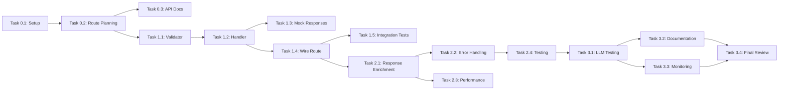

# Implementation Plan: Job-Fit Evaluation API Endpoint

## 1. Assignment Details (Injected Context)
> Create a detailed implementation plan for the `/evaluate/job-fit` API endpoint. First, analyze the existing codebase to understand the current architecture and patterns, then create a comprehensive plan that follows the existing design patterns.

## 2. Referenced Documents
- docs/api-architecture.md
- src/api/routes/v2/evaluation.routes.js
- src/prompts/jobFit.critic.js
- src/llm/providers/mock.js
- src/api/validators/evaluation.validators.js

## 3. Executive Summary
- **Total Effort:** 5-7 days
- **Team Size:** 1-2 developers (1 senior, optionally 1 junior for testing)
- **Key Risks:** 
  1. LLM response parsing consistency
  2. Performance impact of separate endpoint
  3. Integration with existing evaluation pipeline
- **MVP Delivery:** 3 days

## 4. Implementation Phases

### Phase 0: Foundation (Day 1)
#### Task 0.1: Project Setup and Analysis
- **Description:** Review existing codebase, understand patterns, set up development environment
- **Acceptance Criteria:**
  - [ ] Development environment running with mock LLM
  - [ ] Understanding of existing route patterns documented
  - [ ] Test framework running successfully
- **Estimate:** 3 hours
- **Dependencies:** None

#### Task 0.2: Route Structure Planning
- **Description:** Design route structure following existing v2 patterns
- **Acceptance Criteria:**
  - [ ] Route path defined (`/v2/evaluate/job-fit`)
  - [ ] Integration plan with existing routes documented
  - [ ] Response schema designed
- **Estimate:** 2 hours
- **Dependencies:** Task 0.1

#### Task 0.3: Update API Documentation
- **Description:** Update openapi.yaml with new endpoint specification
- **Acceptance Criteria:**
  - [ ] OpenAPI spec includes `/evaluate/job-fit` endpoint
  - [ ] Request/response schemas documented
  - [ ] Examples provided
- **Estimate:** 2 hours
- **Dependencies:** Task 0.2

### Phase 1: Core MVP (Days 2-3)
#### Task 1.1: Create Job-Fit Validator
- **Description:** Implement request validator for job-fit endpoint
- **Acceptance Criteria:**
  - [ ] Validator validates job_description (required, min 100 chars)
  - [ ] Validator validates resume (required, min 100 chars)
  - [ ] Optional parameters validated (provider, model, temperature)
  - [ ] Error messages are clear and helpful
- **Estimate:** 2 hours
- **Dependencies:** Task 0.2

#### Task 1.2: Implement Job-Fit Handler
- **Description:** Create handler function following functional patterns
- **Acceptance Criteria:**
  - [ ] Handler uses asyncHandler wrapper
  - [ ] Extracts parameters using functional helper
  - [ ] Calls jobFitCritic with correct parameters
  - [ ] Returns standardized response format
- **Estimate:** 4 hours
- **Dependencies:** Task 1.1

#### Task 1.3: Add Mock Responses
- **Description:** Enhance mock provider with job-fit specific responses
- **Acceptance Criteria:**
  - [ ] Mock returns realistic job-fit scores
  - [ ] Different scenarios covered (excellent, good, fair, poor)
  - [ ] Response matches expected schema
- **Estimate:** 2 hours
- **Dependencies:** Task 1.2

#### Task 1.4: Wire Up Route
- **Description:** Connect route to Express router in v2
- **Acceptance Criteria:**
  - [ ] Route accessible at `/v2/evaluate/job-fit`
  - [ ] Middleware chain correct (responseLogger, validator, sanitize, handler)
  - [ ] Route appears in v2 info endpoint
- **Estimate:** 2 hours
- **Dependencies:** Task 1.2

#### Task 1.5: Basic Integration Tests
- **Description:** Write integration tests for happy path
- **Acceptance Criteria:**
  - [ ] Test successful job-fit evaluation
  - [ ] Test validation errors
  - [ ] Test with mock provider
- **Estimate:** 3 hours
- **Dependencies:** Task 1.4

### Phase 2: Enhancement (Days 4-5)
#### Task 2.1: Response Enrichment
- **Description:** Add detailed analysis to response
- **Acceptance Criteria:**
  - [ ] Include breakdown scores (experience, skills, industry, level)
  - [ ] Add actionable recommendations
  - [ ] Include confidence metrics
- **Estimate:** 4 hours
- **Dependencies:** Task 1.4

#### Task 2.2: Error Handling Enhancement
- **Description:** Implement comprehensive error handling
- **Acceptance Criteria:**
  - [ ] LLM failures handled gracefully
  - [ ] Parsing errors return meaningful messages
  - [ ] Timeout handling implemented
- **Estimate:** 3 hours
- **Dependencies:** Task 2.1

#### Task 2.3: Performance Optimization
- **Description:** Optimize response time and caching
- **Acceptance Criteria:**
  - [ ] Response time under 3 seconds with real LLM
  - [ ] Caching strategy documented
  - [ ] Monitoring hooks added
- **Estimate:** 4 hours
- **Dependencies:** Task 2.1

#### Task 2.4: Comprehensive Testing
- **Description:** Add unit tests and edge case coverage
- **Acceptance Criteria:**
  - [ ] Unit tests for all helper functions
  - [ ] Edge cases tested (empty inputs, malformed responses)
  - [ ] Test coverage > 80%
- **Estimate:** 4 hours
- **Dependencies:** Task 2.2

### Phase 3: Production Ready (Days 6-7)
#### Task 3.1: Real LLM Provider Testing
- **Description:** Test with actual LLM providers
- **Acceptance Criteria:**
  - [ ] Tested with OpenAI
  - [ ] Tested with Gemini
  - [ ] Response parsing verified
- **Estimate:** 3 hours
- **Dependencies:** Task 2.4

#### Task 3.2: Documentation
- **Description:** Create comprehensive documentation
- **Acceptance Criteria:**
  - [ ] API documentation updated
  - [ ] Usage examples created
  - [ ] Integration guide written
- **Estimate:** 3 hours
- **Dependencies:** Task 3.1

#### Task 3.3: Monitoring and Logging
- **Description:** Add production monitoring
- **Acceptance Criteria:**
  - [ ] Structured logging implemented
  - [ ] Metrics collection added
  - [ ] Alert thresholds defined
- **Estimate:** 3 hours
- **Dependencies:** Task 3.1

#### Task 3.4: Final Review and Deployment Prep
- **Description:** Code review and deployment preparation
- **Acceptance Criteria:**
  - [ ] Code review completed
  - [ ] Linting passes
  - [ ] Deployment checklist created
- **Estimate:** 2 hours
- **Dependencies:** All previous tasks

## 5. Dependency Graph


## 6. Risk Mitigation
| Risk | Impact | Probability | Mitigation |
|------|---------|-------------|------------|
| LLM response inconsistency | High | Medium | Implement robust JSON parsing with fallbacks |
| Performance degradation | Medium | Low | Use existing LLM client with retry logic |
| Breaking existing functionality | High | Low | Comprehensive test coverage, feature flag |
| Scope creep | Medium | Medium | Strict MVP focus, defer enhancements |

## 7. Success Metrics
- [ ] Endpoint responds in < 3 seconds (p95)
- [ ] 100% of valid requests return valid job_fit_score
- [ ] Zero regression in existing endpoints
- [ ] Mock provider works for local development
- [ ] API documentation is complete and accurate

## 8. Technical Implementation Details

### Route Implementation Pattern
```javascript
// src/api/routes/v2/jobFit.routes.js
const createJobFitRoutes = () => {
  const router = express.Router();
  
  const createJobFitHandler = () => asyncHandler(async (req, res) => {
    // Extract parameters
    const params = extractJobFitParams(req.body);
    
    // Create LLM client
    const client = await createLLMClient(params);
    
    // Execute job fit evaluation
    const result = await evaluateJobFit(client, params);
    
    // Format response
    res.json(formatJobFitResponse(result));
  });
  
  router.post(
    '/job-fit',
    responseLogger(),
    createJobFitValidator(),
    sanitizeRequest,
    createJobFitHandler()
  );
  
  return router;
};
```

### Response Schema
```json
{
  "job_fit_score": 0.78,
  "match_category": "good",
  "experience_level_match": true,
  "core_skills_match": true,
  "industry_match": true,
  "key_gaps": ["Advanced cloud architecture experience"],
  "transferable_strengths": ["Strong programming skills", "Team leadership"],
  "fit_summary": "Good alignment with most requirements",
  "recommendation": "proceed_with_full_evaluation",
  "breakdown": {
    "experience_score": 0.8,
    "skills_score": 0.75,
    "industry_score": 0.9,
    "level_score": 0.7,
    "essential_requirements_score": 0.85
  },
  "confidence": 0.92,
  "execution_time": 1.24,
  "llm_provider": "openai",
  "llm_model": "gpt-4o-mini",
  "version": "0.22.0"
}
```

## 9. Attestation
- **Agent:** implementation-planner
- **Qualifications:** 15+ years implementation planning, agile expert, technical architect
- **Statement of Completion:** I attest that this implementation plan has been created with full diligence according to the R.A.C.R. methodology, following existing codebase patterns and functional programming principles.